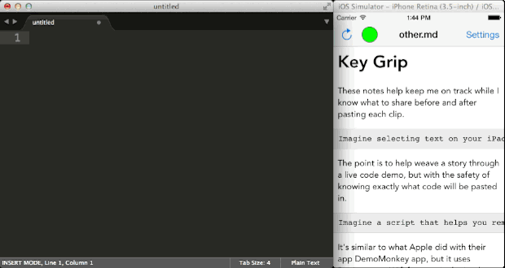

# KeyGrip

KeyGrip is a simple remote pasteboard and presentation notes app. You write your notes in [Markdown][md], drop the file into the Mac server application, fire up the companion iOS app on the same Wifi network, and *boom*. You see your presentation notes and can tap on text snippets to have them automatically transfered to the Mac's pasteboard.

## Why Would I Use This?

Giving talks with live code demos is useful but hard to do for two reasons: Typing correctly in real time is hard. And telling a story with your demo is also hard.

KeyGrip helps by being a remote pasteboard on an iOS device and also a collection of presentation notes. You can use the notes to keep focused on the story you were trying to tell with the demonstration, and you can tap on the blocks of text to populate the Mac's pasteboard and simply paste in the next step of the demonstration. No live typing means fewer hiccups on the fly. Think of this as a live performance tool.

## Installation

There are two pieces, the Mac server app and the iOS client app. You'll need Xcode 5.1, a Mac running Mavericks and an iOS 7.1 device in order to use this. In order to be able to build and install the app on your iOS device, you'll need to have a paid Apple developer account.

### Mac Server App

Open `server/KeyGripServer.xcodeproj`. Then choose the "Install KeyGripServer" scheme from the scheme chooser. Simply build the project and this scheme will copy the `KeyGripServer.app` bundle ready to go into the `/Applications` directory.

When you double click to run the app, you'll want to type in a Bonjour identifier into the text field. You'll use this same identifier on the iOS client.

### iOS Client App

Open `client/KeyGrip.xcodeproj`. Then use the usual process to build and run to install on your attached iOS device. Once the app runs, tap the `Settings` button and make sure you type in the same Bonjour identifier as you typed in the Mac server app.

## How To Use

Write a [Markdown][md] document and make sure it has a `.txt`, `.md`, or `.markdown` extension. Indent any code block or text snippet you want to paste with four spaces, like the following:

    This is a "code block" in Markdown. It will be tappable in the iOS client.

Launch the KeyGripServer app. Then drag and drop the file onto the application window. You're now serving the file.

Launch the companion iOS client application. Make sure both the client and server are on the same Wifi network and using the same Bonjour identifier. They will immediately connect and you'll see the HTML version of your document in the iOS client.

Now, tap on any indented code block. You'll see it appear in the preview pane of the server application and the text is now on your Mac's pasteboard.

If you edit your document and save your changes the server app will notice the changes, reload the document, and send it over to the client automatically.

Enjoy!

## Contributing

Feel free to fork the project and submit a pull request with bug fixes. If you have architecture changes or new feature ideas in mind, then please open an issue to discuss it first. That gives some time to weigh in on options before those pull requests start coming in.

## Licensing

KeyGrip is licensed under GPLv3. Please see the LICENSE file for more info.

Short answer: feel free to fork the project but you can't bundle any of the source in your own proprietary applications.

## Donations

... TODO

## Special Thanks

Thanks to Gabriel Handford and Sveinung Kval Bakken for their work on the `XCTAsyncTestCase` class used in the network protocol tests. Check the license on that source file for more info.

Thanks to John Gruber's original `markdown.pl` script which is bundled with the server to generate the HTML for display on the client.

Derek Briggs from [Neo Innovation](www.neo.com) did an awesome job on the icon. Give him some love and a hug.

  [md]: https://daringfireball.net/projects/markdown/
